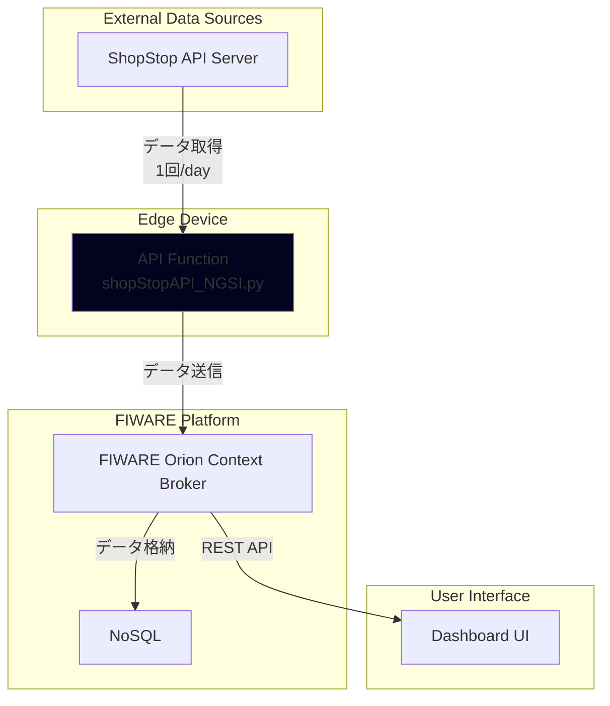

```mermaid

graph TD
    A[ShopStop API Server] -->|データ取得<br>1回/day| B[API Function<br>shopStopAPI_NGSI.py]
    B -->|データ送信| D[FIWARE Orion Context Broker]
    D -->|データ格納| E[NoSQL]
    D -->|REST API| G[Dashboard UI]

    subgraph Edge Device
        B
    end

    subgraph FIWARE Platform
        D
        E
    end

    subgraph External Data Sources
        A
    end

    subgraph User Interface
        G
    end
    
    style B fill:#030320


```
