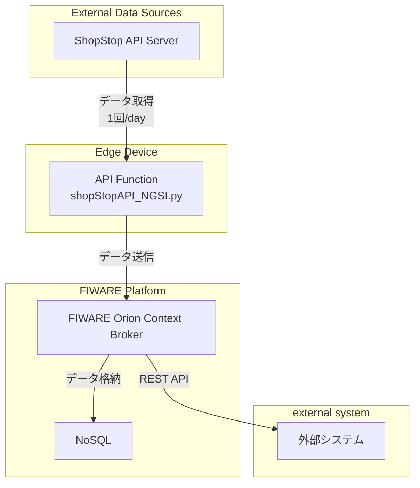

## シーケンス図の説明

このシーケンス図は、**ShopStop API Server** から始まるデータの流れを表しており、外部データソースから取得されたデータが、処理、格納、そしてユーザーに可視化されるまでのプロセスを示しています。

### システムの主要コンポーネント

#### 1. External Data Sources
- **ShopStop API Server**  
  外部データソースであり、1日1回の頻度でデータを提供します。これがシステムのデータ入力源となります。

#### 2. Edge Device
- **API Function (shopStopAPI_NGSI.py)**  
  ShopStop API Serverから取得したデータを処理し、FIWAREプラットフォームに送信します。
  FIWAREの仕様に沿いデータの送信を行います。
  デバイスの設置は、ISIT様に設置予定です。

#### 3. FIWARE Platform
- **Orion Context Broker**  
  福岡市のデータ共通基盤です。
